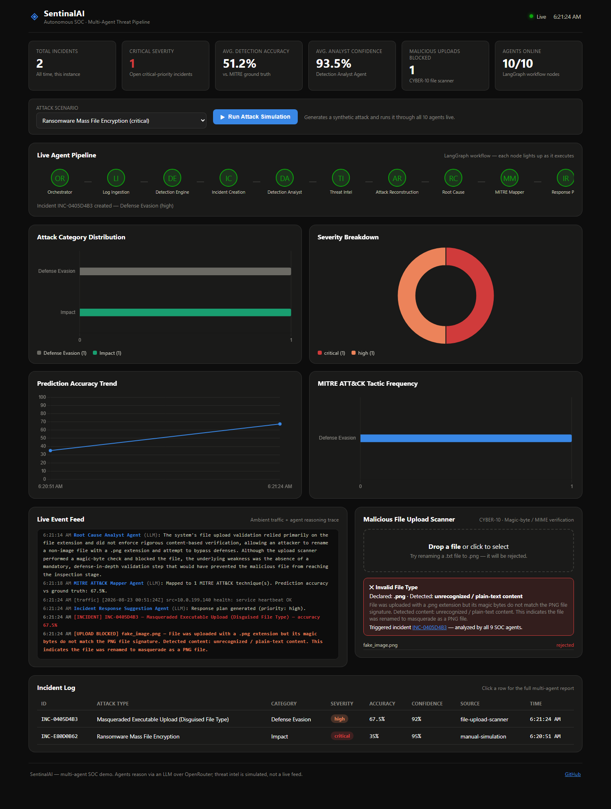

# SentinalAI

A real-time, multi-agent Security Operations Center (SOC). Synthetic attack
traffic (or an actual malicious file upload) is analyzed live by a 9-agent
[LangGraph](https://github.com/langchain-ai/langgraph) pipeline — detection,
analyst reasoning, threat intel, attack reconstruction, root cause analysis,
MITRE ATT&CK mapping, and response planning — and every step streams to a
live dashboard over WebSocket.



## What it does

- **10 pipeline agents** (Orchestrator + 9 analytical agents) built with
  LangGraph, wired as a real state machine — not a scripted demo. Benign
  traffic is routed straight to `END`; only real detections continue into
  the full LLM-backed investigation chain.
- **Real LLM reasoning** for the analytical agents (Detection Analyst, Threat
  Intelligence, Attack Reconstruction, Root Cause, MITRE Mapper, Incident
  Response), via OpenRouter, with automatic fallback across free-tier models
  and a deterministic backup path if every model call fails — the pipeline
  never crashes.
- **A live dashboard**: agent pipeline diagram that lights up node-by-node in
  real time, KPI tiles, attack-category/severity/MITRE-tactic charts, an
  accuracy trend line, a live event console, and a full per-incident report
  modal (raw logs → detections → analyst notes → threat intel → timeline →
  root cause → MITRE techniques → response plan → full agent trace).
- **A genuine prediction-accuracy score** — each scenario carries known
  ground-truth MITRE techniques; the agents don't see that ground truth, so
  the score reflects whether they actually got it right.
- **CYBER-10: Malicious File Upload Scanner** — real magic-byte/MIME
  verification. A `.txt` renamed to `.png` is rejected with `Invalid File
  Type` because its bytes don't match the PNG signature; any file whose bytes
  match a dangerous signature (PE/ELF/script/archive) is rejected outright.
  A rejected upload automatically becomes an incident and is investigated by
  the same 9-agent pipeline.

See [`docs/ARCHITECTURE.md`](docs/ARCHITECTURE.md) for the full design
write-up — what's wired to what, and why.

## Running it

```bash
cd backend
python -m venv .venv
.venv\Scripts\pip install -r requirements.txt   # Windows
# source .venv/bin/activate && pip install -r requirements.txt   # macOS/Linux

cp .env.example .env   # then set OPENROUTER_API_KEY
.venv\Scripts\python -m uvicorn app.main:app --port 8000
```

Open `http://127.0.0.1:8000/`. Click **Run Attack Simulation** to trigger a
random attack, or pick one from the dropdown. Try the file scanner: rename
any `.txt` file to `.png` and drop it in.

## Stack

FastAPI · LangGraph · SQLite · OpenRouter (free-tier models by default) ·
vanilla HTML/CSS/JS dashboard with Chart.js.

## Notes

Threat intelligence is **simulated** by the LLM for demo purposes — it is not
a live external feed, and the dashboard says so. No authentication is
implemented; do not expose this publicly as-is.
